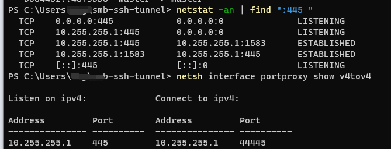

# smb-ssh-tunnel

Connect samba server with different ports on Windows

In Windows, smb is only supported with port 445, which is commonly blocked by firewalls. Two ways to avoid port 445 being blocked:

- Use another port on the server. However, Windows explorer can't use any port other than 445. We can use smb.ps1 to workaround that.
- If the service is behind some gateways, the NAT policy of the gateways may be limited. Or we don't want the SMB protocol be detected, we can use ssh-smb.ps1 to proxy our smb.


These Powershell scripts create a loopback network adapter to proxy the ports as a workaround. The ssh-smb also creates a task scheduler to automatically establish a ssh tunnel to connect to the samba server.
Then we can connect to smb server with the added loopback NIC (by default, \\\\10.255.255.1\\) to access the smb behind firewalls.

Need:

- smb server
- ssh server (for ssh-smb)
- private and public keys to connect ssh (for ssh-smb, since openssh doesn't support password in command line).

From Win 10, openssh is built-in by OS. No need for other ssh clients.

## Usage

```
.\smb.ps1 DESTINATION_IP DESTINATION_PORT
```

or with ssh

```
.\ssh-smb.ps1 "<user>@<ip> -p <SSH_Port> -i <private_key>"
```

if you want to specify the added NIC's ip and name (default are 10.255.255.1 and "Loopback"), use

```
.\smb.ps1 DESTINATION_IP DESTINATION_PORT NIC_IP NIC_NAME
```

or with ssh

```
.\ssh-smb.ps1 "<user>@<ip> -p <SSH_Port> -i <private_key>" DESTINATION_IP NIC_IP NIC_NAME
```

(DESTINATION_IP is 127.0.0.1 if smb server is the same as the ssh server.)

Then reboot.

## Example

To connect to ip 114.514.19.19 and smb server port 810:

```
.\smb.ps1 114.514.19.19 810
```

or with ssh and normal smb port 445:

```
.\ssh-smb.ps1 "aaaah@114.514.19.19 -p 22 -i <private_key>"
```

Since one NIC can only proxy one smb server, multiple NIC with different name and ip need to be added:

```
.\smb.ps1 114.514.19.19 810 10.255.254.1 Loopback2
```

or with ssh and normal smb port 445:

```
.\ssh-smb.ps1 "aaaah@114.514.19.19 -p 22 -i <private_key>" 127.0.0.1 10.255.254.1 Loopback2
```

or the ssh server is not the same as the smb server, the smb server's internal network ip is 192.168.114.514:

```
.\ssh-smb.ps1 "aaaah@114.514.19.19 -p 22 -i <private_key>" 192.168.114.514 10.255.254.1 Loopback2
```

## Test

To test the result, execute the two commands:

```
netstat -an | find ":445 "
netsh interface portproxy show v4tov4
```

The results should be like (with default NIC ip 10.255.255.1)



The line

```
TCP    10.255.255.1:445       0.0.0.0:0              LISTENING
```

should exists.

Then you can access smb server with locations like \\\\10.255.255.1\\some_location
